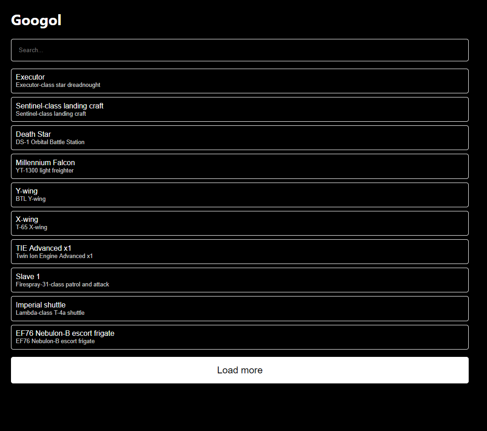

# Googol

Com o Googol você pode ver pesquisar e ver detalhes de todas as naves espaciais de Star Wars.



## Instalação

Clone o repositório para uma pasta local em seu computador:

```bash
git clone https://github.com/neubaner/googol
```

Instale as dependêcias do projeto:

```bash
npm install
```

Iniciar o servidor de desenvolvimento:

```bash
npm start
```

Ou se preferir, inicie o servidor de produção:

```bash
PORT=<PORTA> npm run server
```

## Créditos

- [SWAPI](https://swapi.co/)
